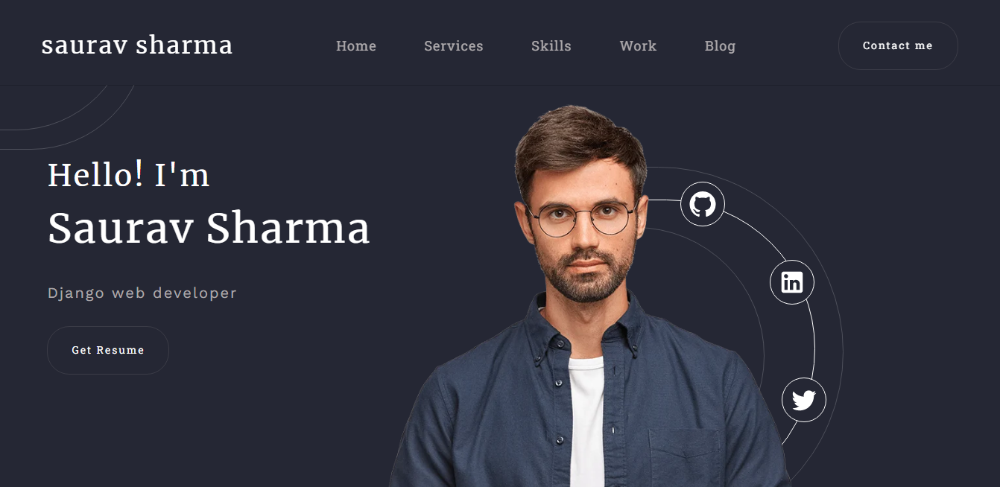
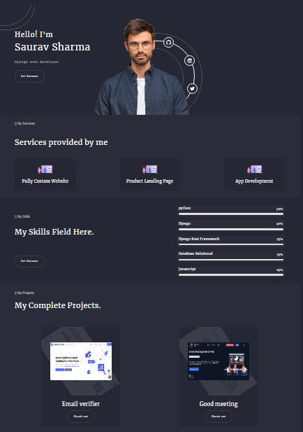

# client-porfolio

## tools and technologies used

### it is a completely responsive portfolio.

## here it's

## Available scripts

`npm i` and `npm start`

### [Checkout out](https://nidhisharma63.github.io/client-portfolio/).

